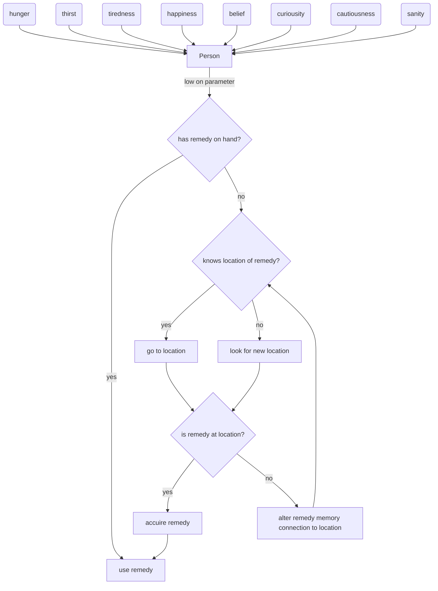
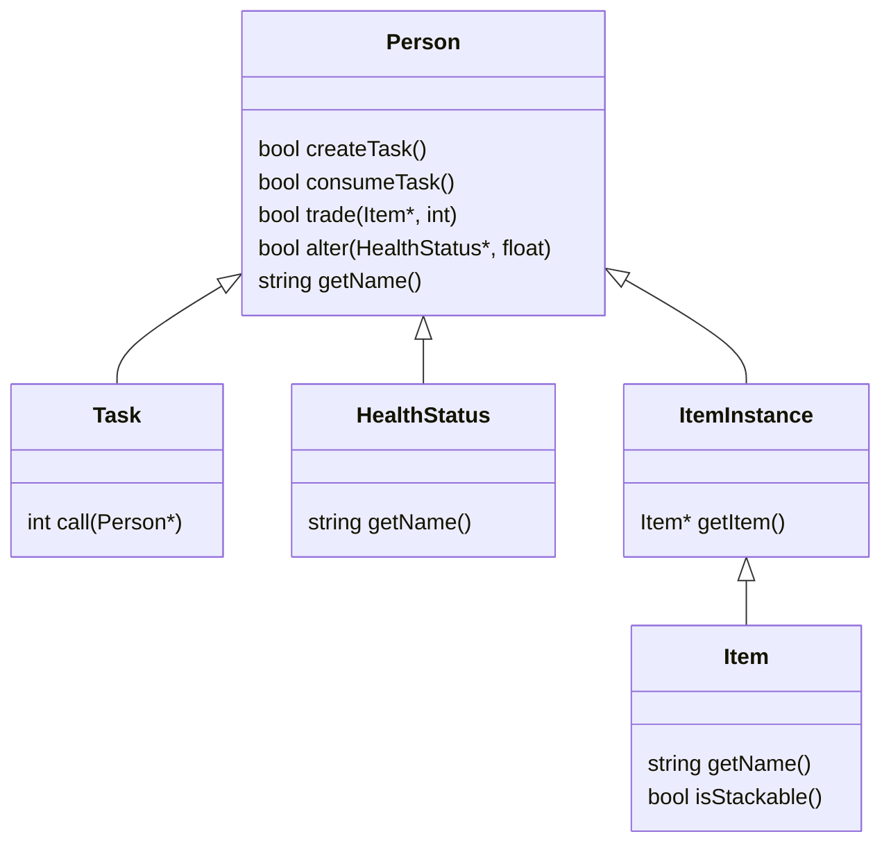
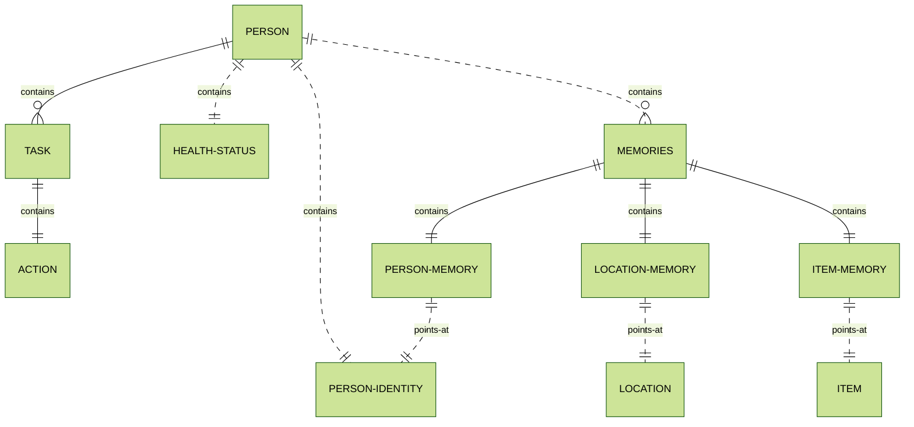

TL;DR:

Small scale city simulation where characters generate their day/life based on needs and wants.
The player possesses a random character everytime the current character loses consiousness.

Start everyday as a different person in a city starting with 100 ppl
Small scale self contained city
Every person starts out with certain goals, needs/wants, known locations, money, health conditions, contracts, ideologies, etc.
Contracts include home and job
Objects have owners bound to them
Limited wardrobe of people

Main loop is that you wake up as a different character everytime you lose consciounsness.
Your actions can alter the goals, needs, behaviour, etc. of the person.
You should be able to look into the mind of the person you are to see the current stats, memories, etc. of the person.

The game should mainly be a sandbox game where you can trigger different endings if you manage to fulfill the requirements.
One example could be to gather enough followers for a cult to bring forth an eldritch horror.
Another could be to overthrow the government into anarchy.
Maybe triggering a zombie apocalypse through a virus, and living through it.

Being drunk should add a delay to all inputs

